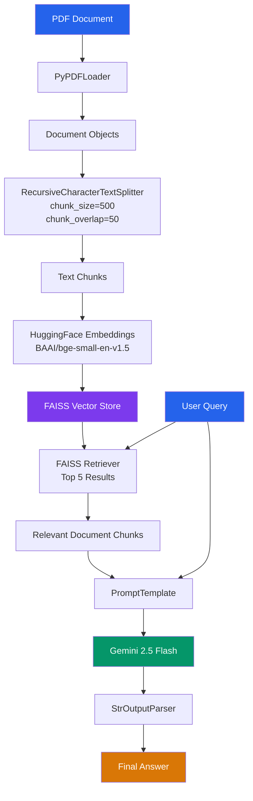
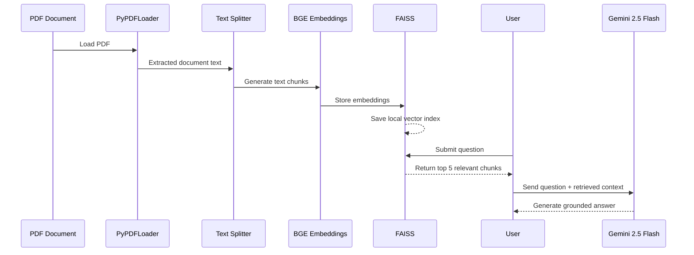

<div align="center">

# PDF RAG CHATBOT

### A lightweight Retrieval-Augmented Generation chatbot for asking questions from a PDF document.

This project demonstrates a simple end-to-end RAG pipeline using **LangChain, HuggingFace embeddings, FAISS, and Google Gemini**.

The application loads a PDF, splits its content into smaller chunks, converts those chunks into vector embeddings, stores them in a local FAISS vector database, retrieves the most relevant chunks for a user query, and uses Gemini 2.5 Flash to generate an answer from the retrieved context.

</div>

---

## Overview

The chatbot follows a simple Retrieval-Augmented Generation architecture:

```text
PDF
 ↓
Text Extraction
 ↓
Text Chunking
 ↓
Embeddings
 ↓
FAISS Vector Store
 ↓
Similarity Retrieval
 ↓
Relevant Context
 ↓
Prompt
 ↓
Gemini 2.5 Flash
 ↓
Answer
```

Instead of passing the complete PDF to the language model for every question, the system retrieves only the most relevant sections of the document and provides them to the model as context.

The prompt also instructs the model to answer only from the retrieved context and return a predefined response when the answer cannot be found in the document.

---

## System Architecture



---

## End-to-End Data Flow

The system can be divided into two stages: document ingestion and question answering.



---

## How the RAG Pipeline Works

### 1. PDF Loading

The PDF is loaded using `PyPDFLoader`.

```python
loader = PyPDFLoader("one.pdf")
docs = loader.load()
```

The loader converts the PDF into LangChain document objects containing the extracted text and metadata.

---

### 2. Text Chunking

The extracted document is split into smaller pieces using `RecursiveCharacterTextSplitter`.

```python
RecursiveCharacterTextSplitter(
    chunk_size=500,
    chunk_overlap=50
)
```

The project uses:

* Chunk size: 500 characters
* Chunk overlap: 50 characters

Chunking makes retrieval more precise because the system can search individual sections of the document instead of the entire PDF.

---

### 3. Embedding Generation

Each chunk is converted into a numerical vector using:

```text
BAAI/bge-small-en-v1.5
```

through LangChain's `HuggingFaceEmbeddings`.

```python
embeddings = HuggingFaceEmbeddings(
    model_name="BAAI/bge-small-en-v1.5"
)
```

These vectors represent the semantic meaning of the text and allow similar questions and document sections to be matched.

---

### 4. FAISS Vector Store

The document chunks and their embeddings are stored in FAISS.

```python
db = FAISS.from_documents(
    documents=chunks,
    embedding=embeddings
)
```

The vector store is also saved locally:

```python
db.save_local("faiss_local")
```

FAISS is responsible for efficiently finding the document chunks that are most similar to a user's question.

---

### 5. Retrieval

The FAISS database is converted into a retriever:

```python
retriever = db.as_retriever(
    search_kwargs={"k": 5}
)
```

For every question, the system retrieves the five most relevant chunks.

```text
User Question
     |
     v
FAISS Similarity Search
     |
     +---- Relevant Chunk 1
     +---- Relevant Chunk 2
     +---- Relevant Chunk 3
     +---- Relevant Chunk 4
     +---- Relevant Chunk 5
```

---

### 6. Context Construction

The retrieved document chunks are combined into a single context:

```python
content = "\n\n".join(
    doc.page_content
    for doc in docs
)
```

This context is then passed to the prompt along with the original question.

---

### 7. Prompt and LLM

The project uses a `PromptTemplate` to control how the context and question are provided to Gemini.

The important instruction is:

```text
Answer ONLY from the provided context.
```

When the answer is not present in the retrieved content, the model is instructed to respond:

```text
I could not find the answer in the document.
```

The language model is:

```python
ChatGoogleGenerativeAI(
    model="gemini-2.5-flash"
)
```

---

### 8. Output Parsing

The final response is converted into a string using:

```python
StrOutputParser()
```

The complete LangChain pipeline is:

```python
chain = prompt | llm | parser
```

Conceptually:

```text
PromptTemplate
      |
      v
Gemini 2.5 Flash
      |
      v
StrOutputParser
      |
      v
Final Answer
```

---

## RAG Query Flow


---

## Technology Stack

| Technology                     | Purpose                                     |
| ------------------------------ | ------------------------------------------- |
| Python                         | Application development                     |
| LangChain                      | RAG pipeline and component integration      |
| PyPDFLoader                    | PDF text extraction                         |
| RecursiveCharacterTextSplitter | Document chunking                           |
| HuggingFace Embeddings         | Converting text into vector representations |
| BAAI/bge-small-en-v1.5         | Embedding model                             |
| FAISS                          | Local vector similarity search              |
| Google Gemini 2.5 Flash        | Answer generation                           |
| PromptTemplate                 | Building the RAG prompt                     |
| StrOutputParser                | Parsing the LLM response                    |
| python-dotenv                  | Loading environment variables               |

---

## Project Architecture

```text
pdf-rag-chatbot/
│
├── one.pdf
├── main.py
├── .env
├── requirements.txt
├── faiss_local/
└── README.md
```

### Main Components

| Component          | Responsibility               |
| ------------------ | ---------------------------- |
| `one.pdf`          | Source knowledge document    |
| `main.py`          | Complete RAG application     |
| `.env`             | API configuration            |
| `requirements.txt` | Python dependencies          |
| `faiss_local/`     | Persisted FAISS vector index |
| `README.md`        | Project documentation        |

---

## Environment Configuration

The project uses `python-dotenv` to load environment variables.

Example:

```env
GOOGLE_API_KEY=your_api_key_here
```

The API key should never be committed to GitHub.

Recommended `.gitignore`:

```gitignore
.env
venv/
.venv/
__pycache__/
*.pyc
```

---

## Running the Project

### 1. Create a virtual environment

```bash
python -m venv venv
```

Windows:

```powershell
venv\Scripts\activate
```

Linux/macOS:

```bash
source venv/bin/activate
```

### 2. Install dependencies

```bash
pip install -r requirements.txt
```

### 3. Add the Gemini API key

Create a `.env` file:

```env
GOOGLE_API_KEY=your_api_key_here
```

### 4. Add the PDF

Place your document in the project directory and name it:

```text
one.pdf
```

### 5. Run the chatbot

```bash
python main.py
```

Example:

```text
You : What is this document about?

AI : ...
```

Type:

```text
exit
```

to close the application.

---

## Key Characteristics

This project is intentionally simple and focuses on demonstrating the core RAG workflow.

### Local Retrieval

PDF processing, embeddings, and vector search are handled locally using:

```text
PyPDFLoader
HuggingFace Embeddings
FAISS
```

### LLM Generation

Only the retrieved context and user question are passed to:

```text
Gemini 2.5 Flash
```

### Context-Grounded Responses

The prompt explicitly instructs the model to answer from the retrieved document context rather than freely answering from general knowledge.

---

## Current Limitations

This is a minimal RAG implementation, so it currently has:

* One PDF configured directly in the source code
* Command-line interface
* No conversation memory
* No web interface
* No authentication
* No multi-document management
* No reranking
* No hybrid search
* No citation display
* No OCR for scanned PDFs
* Local FAISS storage

---

## Future Improvements

Possible extensions include:

```text
Multiple PDF Uploads
        ↓
Document Management
        ↓
Persistent Vector Database
        ↓
Hybrid Retrieval
        ↓
Reranking
        ↓
Conversation Memory
        ↓
Source Citations
        ↓
Web Interface
```

---

## Core RAG Concept

```text
                  DOCUMENT INGESTION

PDF
 |
 v
PyPDFLoader
 |
 v
Chunking
 |
 v
BGE Embeddings
 |
 v
FAISS
 |
 v
Vector Store


                  QUESTION ANSWERING

User Question
 |
 v
FAISS Retrieval
 |
 v
Top 5 Relevant Chunks
 |
 v
Prompt + Context
 |
 v
Gemini 2.5 Flash
 |
 v
Final Answer
```

---

## Conclusion

This project is a compact implementation of a PDF-based Retrieval-Augmented Generation system.

It demonstrates the essential RAG pipeline:

```text
Load
  ↓
Split
  ↓
Embed
  ↓
Store
  ↓
Retrieve
  ↓
Augment
  ↓
Generate
```

The project combines local semantic retrieval with Gemini-based generation, making it a straightforward example of how a document can be turned into a question-answering system using modern LLM and vector-search technologies.

---

<div align="center">

Built with Python, LangChain, HuggingFace, FAISS, and Google Gemini

</div>
