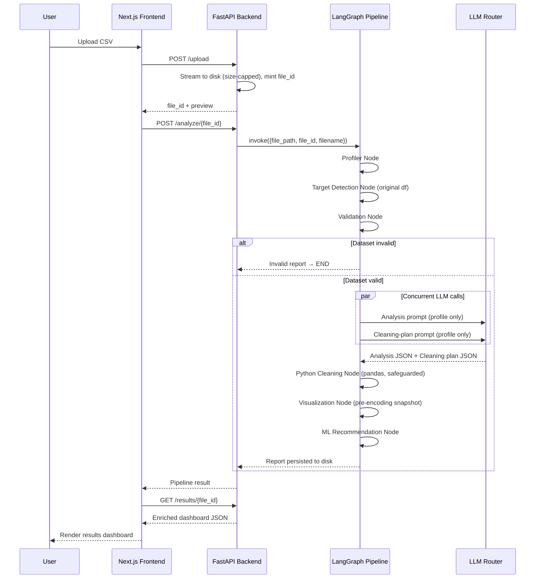

<div align="center">

# DATA AGENT

### Upload a CSV. Get a full analysis, a cleaned dataset, charts, and ML model recommendations.

Data Agent is an AI-powered data-analysis pipeline. Upload a CSV and the system profiles it,
detects the likely prediction target, validates it, asks an LLM for an analysis and a cleaning
**plan** (built only from a statistical profile — the model never sees your raw data), executes
the cleaning deterministically in pandas, generates charts, and recommends suitable ML
algorithms with plain-language reasoning.

[Live Demo](https://data-analyst-agent-topaz.vercel.app) • [Report Bug](https://github.com/AaryaMakthala/DATA-AGENT/issues) • [Request Feature](https://github.com/AaryaMakthala/DATA-AGENT/issues)

> Hosted on a free tier — the first load after idling may take a minute or two.


</div>

---

## Table of Contents

- [Overview](#overview)
- [System Architecture](#system-architecture)
- [End-to-End Data Flow](#end-to-end-data-flow)
- [Key Features](#key-features)
- [Technology Stack](#technology-stack)
- [API Reference](#api-reference)
- [Getting Started](#getting-started)
- [Project Structure](#project-structure)
- [Environment Variables](#environment-variables)
- [Storage & Data Lifecycle](#storage--data-lifecycle)
- [Security](#security)
- [Testing](#testing)
- [Known Limitations](#known-limitations)
- [Roadmap](#roadmap)
- [License](#license)

---

## Overview

Data Agent automates the core workflow of a data analyst. A user uploads a CSV file, and the
system runs it through a pipeline that:

1. **Profiles** the dataset — row/column counts, dtypes, missing values, duplicates, ragged rows
2. **Detects identifier columns** (IDs, GUIDs, indexes) so they're excluded from analysis
3. **Detects the likely prediction target** using a confidence-based scoring approach, run on the *original, unencoded* data
4. **Validates** the dataset — rejects empty, single-column, all-duplicate, single-class-target, or no-usable-feature datasets before any LLM call
5. **Generates an AI analysis + a cleaning plan** concurrently, from a compact statistical profile only
6. **Executes the cleaning plan deterministically** in pandas, with safeguards (target protection, row-drop ceilings, imputation self-checks)
7. **Generates charts** from a pre-encoding snapshot of the cleaned data
8. **Recommends ML algorithms** with a rule-based scorer and a deterministic 0–100 data quality score

A core design principle: **the LLM never sees raw data.** Only `json.dumps(profile)` — a
statistical summary — is ever sent to a language model. All actual data mutation happens in
pandas, so results are reproducible and free of hallucinated transformations.

---

## System Architecture

```mermaid
graph TD
    classDef client fill:#3b82f6,stroke:#1d4ed8,stroke-width:2px,color:#fff;
    classDef aiNode fill:#8b5cf6,stroke:#6d28d9,stroke-width:2px,color:#fff;
    classDef pyNode fill:#10b981,stroke:#047857,stroke-width:2px,color:#fff;
    classDef decision fill:#64748b,stroke:#475569,stroke-width:2px,color:#fff;
    classDef output fill:#f59e0b,stroke:#b45309,stroke-width:2px,color:#fff;

    User(["User uploads CSV"]):::client
    Frontend["Next.js Frontend"]:::client
    API["FastAPI Backend<br/>POST /upload → POST /analyze/&#123;file_id&#125;"]:::client

    subgraph LG [LangGraph Pipeline — 7 nodes]
        Profiler["1 · Profiler Node<br/>load_dataframe + profile_dataframe"]:::pyNode
        TargetDetect["2 · Target Detection Node<br/>runs on original, unencoded df"]:::pyNode
        Validate{"3 · Validation Node"}:::decision
        LLMAnalysis["4a · LLM: Dataset Analysis"]:::aiNode
        LLMClean["4b · LLM: Cleaning Plan"]:::aiNode
        Cleaner["5 · Python Cleaning Node<br/>deterministic, target-protected"]:::pyNode
        Viz["6 · Visualization Node<br/>pre-encoding snapshot"]:::pyNode
        MLRec["7 · ML Recommendation Node<br/>re-profile + rule-based ranking"]:::pyNode
    end

    Invalid["Invalid Dataset Report"]:::output
    Report["Report JSON + Charts<br/>+ Cleaned CSV"]:::output
    Dashboard["Interactive Dashboard"]:::client

    User --> Frontend --> API --> Profiler
    Profiler --> TargetDetect --> Validate
    Validate -- "Invalid → END" --> Invalid --> Dashboard
    Validate -- "Valid" --> LLMAnalysis
    Validate -- "Valid" --> LLMClean
    LLMAnalysis --> Cleaner
    LLMClean --> Cleaner
    Cleaner --> Viz --> MLRec --> Report --> Dashboard
```



**Why this holds up:**

| Principle | How it's achieved |
|---|---|
| Privacy-first | The LLM only ever receives a JSON statistical profile, never the raw CSV |
| Deterministic processing | AI decides *what* to do; pandas performs the *actual* cleaning |
| Modular workflow | LangGraph separates each stage into an independent, testable node |
| Concurrent execution | Analysis + cleaning-plan LLM calls run in parallel on a 2-worker pool |
| Fail-fast validation | Invalid datasets route straight to `END` — no wasted LLM calls |
| Provider resilience | Automatic fallback: Groq → Gemini → OpenRouter |
| No database required | Every upload is ephemeral; a TTL sweeper purges artifacts automatically |

---

## End-to-End Data Flow



Two design decisions worth calling out:

- **Target detection runs before preprocessing.** Encoding a categorical target (e.g. turning
  `Purchased` into `Purchased_Yes` / `Purchased_No`) destroys the information needed to identify
  it, so detection always runs against the original dataframe.
- **Charts are generated before one-hot encoding.** Encoded categorical columns produce
  unreadable, fragmented charts, so visualization uses a pre-encoding snapshot, which is then
  discarded.

---

## Key Features

### Automated Dataset Profiling
Row/column statistics, dtypes, missing values, duplicates, and outliers — with encoding-fallback
handling and automatic detection/repair of ragged CSVs and one-line preambles.

### Confidence-Scored Target Detection
Rather than assuming the last column is the target, a scoring approach evaluates column-name
semantics, data type, cardinality, and class balance — surfacing alternative candidates with
their own confidence scores.

### Identifier Detection & Filtering
Customer IDs, employee IDs, transaction IDs, GUIDs, and record indexes are automatically
excluded from feature reasoning, correlation analysis, and charting.

### Fail-Fast Validation
Empty datasets, single-column datasets, all-duplicate datasets, single-class targets, and
datasets with no usable features are rejected **before** any LLM call, and the frontend renders
a dedicated invalid-dataset state instead of failing silently.

### Rule-Based ML Algorithm Recommendation
Algorithms are ranked using dataset characteristics — size, feature composition, categorical
ratio, outlier presence, class imbalance — with a plain-language justification for each pick.
This is a deterministic rule-based recommender, not a trained scikit-learn model.

### AI-Assisted Cleaning, Deterministically Executed
The LLM proposes a cleaning *plan* (imputation strategy, outlier treatment, encoding, column
drops) from the statistical profile. The plan is then executed by the Python cleaning engine
with safeguards: the target column is never dropped or altered, column-drop kicks in only past
a 10% row-drop threshold, imputation is back-checked, and category encoding is capped at 50
categories.

### AI-Written Analysis Reports
A natural-language report describing patterns, correlations, and data-quality issues found in
the dataset profile.

### Visual Insights
Bar charts, histograms, scatter plots, and correlation heatmaps, generated from the
pre-encoding snapshot of the cleaned data.

### Downloadable Outputs
Every artifact the pipeline produces can be downloaded directly from the dashboard, no extra
setup required:

| Download | Format | Contents |
|---|---|---|
| Cleaned dataset | `.csv` | The fully cleaned, model-ready dataset |
| Full report | `.json` | Complete structured pipeline output |
| Analysis report | `.txt` | Plain-text AI-written analysis |
| Cleaning log | `.txt` | Plain-text record of every cleaning step applied |
| Charts bundle | `.zip` | All generated chart PNGs for that run |

Downloads remain available for the duration of the artifact's retention window (15 minutes by
default) before the TTL sweeper removes them.

### Resilient Multi-Provider LLM Execution
The two LLM calls — analysis and cleaning plan — run concurrently on a thread pool. Each call
has a 30-second SDK timeout enforced under a hard 40-second wall-clock ceiling; if a provider
fails, the router automatically falls back to the next one (Groq → Gemini → OpenRouter). If all
three fail, a single typed `LLMRouterError` is raised as an HTTP 502.

### Verified Test Coverage
62 backend tests across 12 files cover the cleaner, profiler, validator, visualizer, ML
recommender, data quality scoring, and end-to-end regressions, backed by fixtures for
classification, regression, no-target, empty, and single-class datasets.

---

## Technology Stack

<table>
<tr>
<td valign="top" width="50%">

**Frontend**


</td>
<td valign="top" width="50%">

**Backend**


</td>
</tr>
<tr>
<td valign="top" width="50%">

**AI / Agent Orchestration**


</td>
<td valign="top" width="50%">

**Deployment**


</td>
</tr>
</table>

| Technology | Role in the project |
|---|---|
| Next.js 15 (App Router) | Frontend framework and routing |
| React 19 + TypeScript | Interactive, type-safe UI |
| Tailwind CSS v4 | Styling system |
| React Hook Form + Zod | Client-side upload validation and results-payload schema validation |
| Framer Motion | Used for a single animated component (`infinite-slider.tsx`) |
| Axios | HTTP client with a URL-scheme guard |
| FastAPI + Pydantic v2 | REST API layer, request/response validation, typed error envelope |
| Pandas / NumPy | Dataset loading, profiling, and cleaning |
| LangGraph 0.2.60 | State-machine orchestration of the 7-node AI pipeline |
| Groq (`openai/gpt-oss-120b`) | Primary LLM provider |
| Gemini (`gemini-flash-latest`) | First fallback LLM provider |
| OpenRouter (`openai/gpt-4o-mini`) | Second fallback LLM provider |
| `ThreadPoolExecutor` | Enforces a hard wall-clock timeout per LLM call and runs the two calls concurrently |
| Vercel | Frontend deployment |
| Render | Backend deployment |

> **Note:** `scikit-learn`, `xgboost`, and `plotly` are pinned in `requirements.txt` but are not
> currently imported anywhere in `app/` — the ML recommendation engine is rule-based, not a
> trained model. There is currently no authentication layer in the application.

---

## API Reference

| Method | Route | Purpose | Error codes |
|---|---|---|---|
| `GET` | `/health` | Liveness check | — |
| `POST` | `/upload` | Save + validate a CSV | `400` `413` `429` |
| `POST` | `/analyze/{file_id}` | Run the full pipeline (synchronous) | `400` `404` `429` `500` `502` |
| `GET` | `/results/{file_id}` | Full dashboard JSON | `404` `500` |
| `GET` | `/download/{file_id}` | Cleaned CSV | `404` |
| `GET` | `/download/json/{file_id}` | Report JSON attachment | `404` |
| `GET` | `/download/cleaning-log/{file_id}` | Plain-text cleaning log | `404` |
| `GET` | `/download/report/{file_id}` | Plain-text analysis report | `404` |
| `GET` | `/download/charts/{file_id}` | Zip of the run's chart PNGs | `404` |
| `GET` | `/charts/{name}` | Static chart mount | — |

All responses use a typed error envelope: `{success, error: {type, message}, detail}`. Every
pipeline stage is timed and persisted under `metadata.processing_metrics`.

---

## Getting Started

### Prerequisites

- Python 3.11+
- Node.js 18+
- npm or yarn
- An API key for at least one LLM provider (Groq, Gemini, or OpenRouter)

### Backend Setup

```bash
cd backend
python -m venv venv
source venv/bin/activate      # On Windows: venv\Scripts\activate
pip install -r requirements.txt
uvicorn app.main:app --reload
```

### Frontend Setup

```bash
cd frontend
npm install
npm run dev
```

The frontend runs at `http://localhost:3000` and talks to the backend at
`http://localhost:8000` by default (`NEXT_PUBLIC_API_URL`).

---

## Project Structure

```
data-agent/
├── backend/
│   ├── app/
│   │   ├── agents/          # LangGraph: graph.py, llm_router.py, state.py
│   │   ├── api/              # routes.py — all 8 API routes + rate limiting
│   │   ├── prompts/           # LLM prompt templates
│   │   ├── services/          # report_adapter.py and file-handling services
│   │   ├── tools/              # profiler, cleaner, visualizer, ml_recommender, validator
│   │   └── utils/               # logging and shared utilities
│   ├── tests/                    # 12 test files, 62 tests
│   ├── test_fixtures/             # sample datasets for classification/regression/edge cases
│   ├── uploads/                    # temporary uploaded files (TTL-purged)
│   ├── outputs/
│   │   ├── charts/                  # generated chart PNGs
│   │   ├── reports/                  # generated JSON analysis reports
│   │   └── cleaned_files/             # cleaned, model-ready datasets
│   ├── runtime.txt                    # python-3.11.11 (Render convention)
│   └── requirements.txt
├── frontend/
│   ├── app/                    # Next.js pages: /, /upload, /results, /about, /features, /how-it-works
│   ├── components/             # React components and UI elements
│   ├── lib/                    # api.ts — Axios client with URL-scheme guard
│   └── types/                  # TypeScript type definitions
└── README.md
```

---

## Environment Variables

**Backend** (`.env` in `backend/`):

| Variable | Description |
|---|---|
| `GROQ_API_KEY` | Primary LLM provider key (at least one of the three LLM keys is required) |
| `GEMINI_API_KEY` | First fallback LLM provider key |
| `OPENROUTER_API_KEY` | Second fallback LLM provider key |
| `LOG_LEVEL` | Logging verbosity |
| `CORS_ALLOW_ORIGINS` | Allowed CORS origins |
| `RATE_LIMIT_ENABLED` | Toggle the in-memory rate limiter |
| `RATE_LIMIT_WINDOW_SECONDS` | Sliding-window size for rate limiting |
| `RATE_LIMIT_UPLOAD_MAX` | Max uploads per window per IP |
| `RATE_LIMIT_ANALYZE_MAX` | Max analyze calls per window per IP |
| `MAX_UPLOAD_MB` | Upload size cap (default 100MB) |
| `MAX_DATASET_ROWS` | Profiler row cap |
| `MAX_DATASET_COLUMNS` | Profiler column cap |
| `MAX_CORRELATION_COLUMNS` | Cap on columns included in correlation analysis |
| `ARTIFACT_RETENTION_HOURS` | TTL for uploaded/generated files (default `0.25`, i.e. 15 minutes) |
| `UPLOAD_FOLDER` | Upload storage path |
| `OUTPUT_FOLDER` | Output storage path |

**Frontend** (`.env.local` in `frontend/`):

| Variable | Description |
|---|---|
| `NEXT_PUBLIC_API_URL` | Backend base URL (default `http://localhost:8000`) |

---

## Storage & Data Lifecycle

There is no database — everything is ephemeral files on disk:

```
uploads/{file_id}.csv                 # original upload
uploads/{file_id}.name.txt            # sidecar: original filename
outputs/cleaned_files/{file_id}.csv   # cleaned dataset
outputs/charts/{file_id}_*.png        # generated charts
outputs/reports/{file_id}.json        # persisted pipeline report
```

A `purge_expired_artifacts()` sweep runs at startup and every 5 minutes, deleting anything past
`ARTIFACT_RETENTION_HOURS` (15 minutes by default).

---

## Security

- **No authentication layer currently exists** — the app relies on rate limiting only.
- File IDs are regex-validated (`^[A-Za-z0-9_-]+$`) and uploaded filenames are sanitized to
  prevent path traversal.
- Uploads are streamed to disk with a size cap enforced during the write, and only `.csv` files
  are accepted.
- Profiler enforces row/column/correlation caps to bound compute.
- CORS is restricted to configured origins with no wildcard, methods limited to
  `GET/POST/OPTIONS`.
- A per-IP sliding-window rate limiter is implemented in-memory (stdlib); this is a
  per-process limitation and `X-Forwarded-For` can be spoofed behind an untrusted proxy.
- Cleaning safeguards: target-column protection, a 10%-row-drop ceiling before falling back to
  column drop, an outlier-skip threshold, a 50-category cap on encoding, and a back-checked
  imputation step (`_fillna_checked`).

---

## Testing

```bash
cd backend
PYTHONPATH=. python -m pytest -q
```

```
62 passed, 16 warnings in 14.02s
```

```bash
cd frontend
npx --no-install tsc --noEmit
```

12 test files / 62 test functions covering: cleaner, profiler, regressions, download-charts,
ML recommender, validator, visualizer, and data quality — with fixtures for classification,
regression, no-target, empty, and single-class datasets. The frontend currently has typecheck
coverage only, no unit test suite.

---

## Known Limitations

- No authentication or user accounts.
- No database — all artifacts are ephemeral with a 15-minute default TTL.
- Rate limiting is in-memory and per-process; it does not survive a restart or scale across
  multiple backend instances.
- Only `.csv` uploads are supported (no Excel, Parquet, or JSON).
- Chart types are limited to bar, histogram, scatter, and correlation heatmap.
- The ML recommendation engine is rule-based; no models are actually trained on the uploaded
  data.
- Hosted on free tiers (Render/Vercel), so the first request after idling can take 1–3 minutes.

---

## Roadmap

- [ ] Asynchronous background processing via a task queue (Celery, Dramatiq, or RQ)
- [ ] Caching of dataset profiles to avoid recomputing results for identical uploads
- [ ] Interactive Plotly-based charts in place of static PNG images
- [ ] User authentication and persistent analysis history
- [ ] Explainable AI via SHAP feature importance for recommended models
- [ ] Support for Excel, Parquet, JSON, and compressed archive formats
- [ ] Distributed rate limiting (Redis-backed) for multi-instance deployments
- [ ] Expanded automated frontend test coverage
- [ ] Upload security hardening: virus scanning and stricter validation

---

## License

This project is currently unlicensed. Add a license file if you intend to distribute or
open-source this project.

---

<div align="center">

Built by [Aarya Makthala](https://github.com/AaryaMakthala)

</div>
